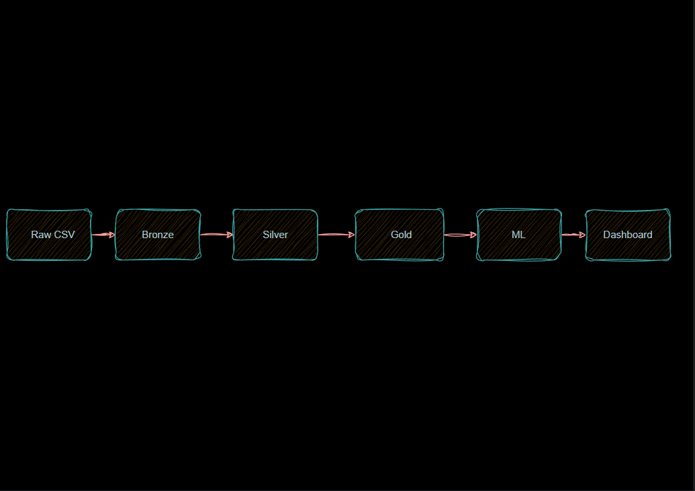
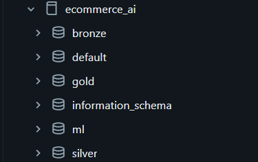
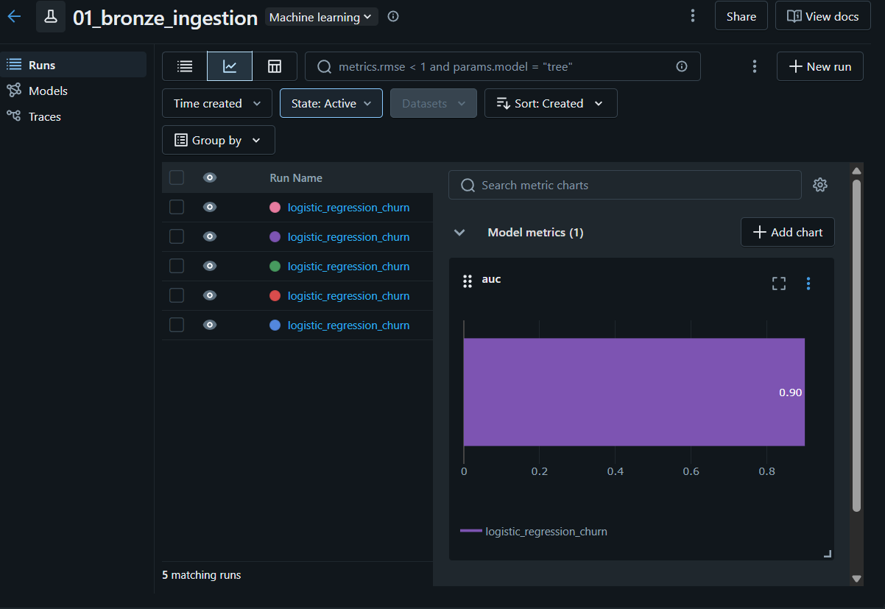
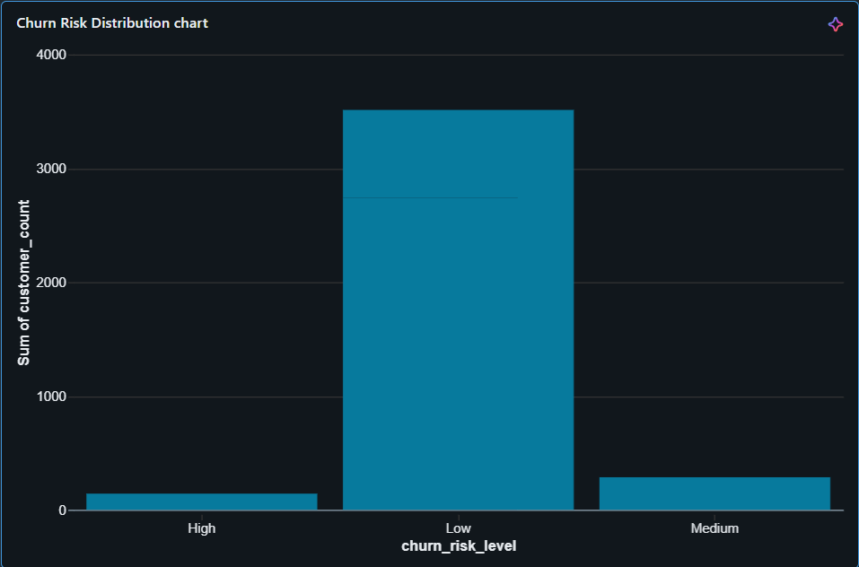
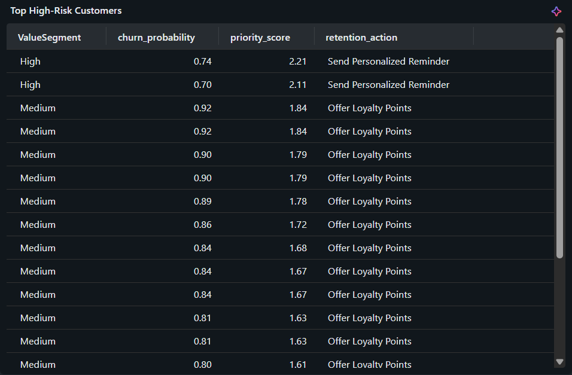

# Databricks-Customer-Churn-Retention-AI  
**End-to-end Databricks Data & AI project for customer churn prediction and retention recommendations**

---

## AI-Driven Customer Churn Prediction & Retention Recommendation System

📌 **Overview**  
This project presents an end-to-end **Data & AI solution built on Databricks** to predict customer churn and generate **actionable retention recommendations** for an e-commerce business.

The system follows a governed **Medallion Architecture (Bronze → Silver → Gold)**, integrates **MLflow** for model tracking, and delivers **business-ready insights through Databricks SQL dashboards**.

---

## 🧠 Problem Statement & AI Framing

Customer churn has a direct impact on revenue, but identifying **which customers are likely to churn** and **what action should be taken** is difficult using traditional rule-based approaches.

### Objective
- Predict customer churn using historical behavioral data  
- Convert churn predictions into prioritized retention actions  

### Why AI?
- Churn depends on multiple interacting behavioral and value-based factors  
- Rule-based systems cannot capture nonlinear patterns  
- AI enables probability-based, risk-aware decision-making  

### ML Task
- **Type:** Binary Classification  
- **Output:** Churn probability (0–1)  
- **Success Criteria:** High recall for churned customers with explainable results  

---

## 🏗️ Architecture Overview

**Architecture Diagram**

The solution is built on **Databricks** using:
- Unity Catalog  
- Delta Lake  
- MLflow  
- Databricks SQL  

---

## 🗂️ Data Architecture (Medallion Model)

**Medallion Tables**

### 🔹 Bronze Layer
- Raw customer churn data  
- Ingested from a Unity Catalog managed volume  
- Stored as Delta tables  

> 🧾 **Table:**  
> `ecommerce_ai.bronze.customer_churn_raw`

---

### 🔹 Silver Layer
- Data cleaning and validation  
- Missing value handling  
- Data type standardization  

> 🧾 **Table Name**  
> `ecommerce_ai.silver.customer_churn_clean`

---

### 🔹 Gold Layer
- Feature-engineered ML dataset  
- Churn scores and retention recommendations  
- Analytics-ready tables  

> 🧾 **Table Names**  
> `ecommerce_ai.gold.customer_features`  
> `ecommerce_ai.gold.customer_churn_scores`  
> `ecommerce_ai.gold.retention_recommendations`

---

## 📊 Dataset Description

The dataset contains anonymized customer-level attributes such as:
- Tenure  
- WarehouseToHome (distance)  
- SatisfactionScore  
- DaySinceLastOrder  
- CashbackAmount  
- Complain (indicator)  
- PreferedOrderCat  
- Churn (target label)  

**Note:**  
Any pretrained models included in the source archive were ignored.  
All models in this project were trained from scratch.

---

## 🧪 Feature Engineering

Key engineered features include:
- Recency risk indicators  
- Customer value segmentation (High / Medium / Low)  
- Tenure buckets  
- Encoded categorical variables  

These features capture **behavioral, engagement, and value-based churn signals**.

---

## 🤖 Model Training & MLflow Tracking

**MLflow Run**

- **Model:** Logistic Regression  
- **Reasoning:** Interpretable, baseline-friendly, business-explainable  
- **Evaluation Metric:** ROC-AUC  

MLflow was used to:
- Track model runs  
- Log Spark ML models  
- Store artifacts in a Unity Catalog volume  

---

## 💡 AI Innovation: From Prediction to Action

The system goes beyond prediction by converting churn probabilities into **business decisions**.

### AI Outputs
- Churn probability score  
- Risk level (High / Medium / Low)  
- Retention recommendation  
- Priority score (Risk × Customer Value)  

### Example Actions
- **High risk + High value** → Discount offer  
- **High risk + Medium value** → Loyalty points  
- **Medium risk** → Personalized reminder  

---

## 📊 Business Dashboard (Databricks SQL)

### 🔹 Churn Risk Distribution

Displays the distribution of churn risk across customers.

---

### 🔹 Retention Actions Required

Shows how many customers require each AI-recommended retention action.

---

### 🔹 Top High-Risk Customers

Ranks customers by priority score to support targeted retention efforts.

---

## 🔁 End-to-End Workflow & Orchestration

The pipeline supports automation using **Databricks Jobs**:
- Data ingestion  
- Feature engineering  
- Model training  
- Customer scoring  

---

## 💼 Business Impact

- Proactive churn prevention  
- Reduced blanket discounting  
- Improved retention ROI  
- Actionable insights for non-technical teams  

---

## ⚠️ Assumptions & Limitations

- Customer-level dataset (no transaction-level data)  
- Churn defined using inactivity-based criteria  
- Model performance may change due to concept drift  

---

## 🔁 Reproducibility

- Upload dataset to Unity Catalog volume  
- Run notebooks in order: **Bronze → Silver → Gold**  
- Train model and generate recommendations  
- View insights in Databricks SQL dashboards  

---

## 🎥 Video Walkthrough
📽️ https://drive.google.com/file/d/1ATUCMAb-ef2IkC2v9mGsjuaNthom1IXJ/view?usp=sharing

---

## 🔗 Links
- **GitHub Repository:** https://github.com/rehannakwa/Databricks-Customer-Churn-Retention-Ai  
- **LinkedIn Post :**   https://www.linkedin.com/posts/rehan-nakwa_completed-end-to-end-databricks-data-ugcPost-7422229365641338880-BTkf?utm_source=share&utm_medium=member_desktop&rcm=ACoAAD1-UDoBvcXVpDI21zkseSmYNysGGWdGFmw

---

## ✅ Evaluation Criteria Coverage
✔ Problem Definition & AI Framing  
✔ Data Understanding & Feature Engineering  
✔ AI Innovation & Insight Generation  
✔ Model Selection & Evaluation  
✔ Database ↔ AI Workflow  
✔ Business Impact & Explainability  
